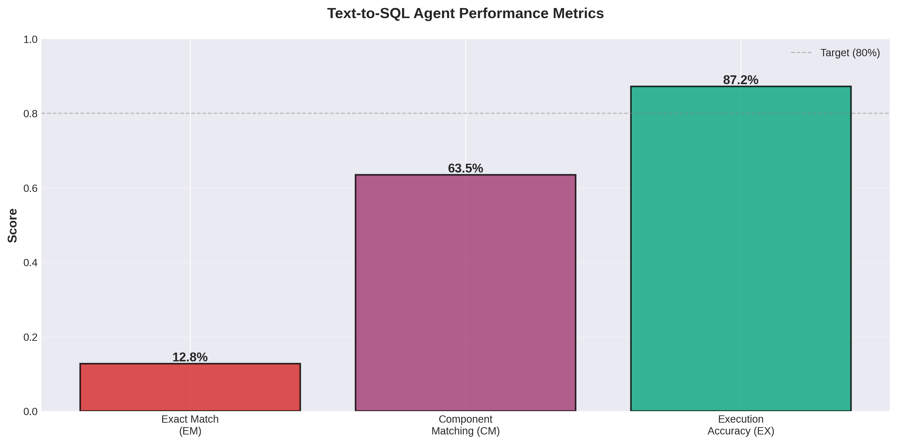

# Text-to-SQL Datasus Agent Evaluation

Evaluation of Text-to-SQL agent performance on Brazilian healthcare data (DATASUS/SIH-RS) using LLaMA 3.1:8b.

## Overview

**Dataset**: 51 ground truth queries across three difficulty levels
- EASY (17): Single table, basic filters, COUNT operations
- MEDIUM (19): Multi-table JOINs, GROUP BY, aggregations
- HARD (15): Complex JOINs, subqueries, mortality calculations

**Model**: Ollama LLaMA 3.1:8b
**Evaluation Date**: October 30, 2025
**Total Execution Time**: 690.32s (13.54s avg per query)

## Evaluation Metrics

Three metrics following Spider benchmark methodology:

**Execution Accuracy (EX)** - Primary metric
- Percentage of queries returning correct results
- Threshold: Score ≥ 0.8 considered correct
- Most critical indicator of agent performance

**Component Matching (CM)**
- Structural similarity between generated and ground truth SQL
- Components: SELECT, FROM, WHERE, GROUP BY, ORDER BY, JOIN, nested queries
- Measures semantic understanding despite different formulation

**Exact Match (EM)**
- Binary match between generated and ground truth SQL
- Least critical - multiple valid SQL queries can produce same results

## Results

### Summary

| Metric | Score |
|--------|-------|
| Agent Success Rate | 92.2% |
| Execution Accuracy (EX) | 87.2% |
| Component Matching (CM) | 63.5% |
| Exact Match (EM) | 12.8% |

High EX (87.2%) with low EM (12.8%) indicates the agent generates semantically correct but syntactically different SQL queries.

---

## Performance Analysis

### By Difficulty Level

| Difficulty | Questions | Success Rate | EX | CM | EM |
|-----------|-----------|--------------|----|----|-----|
| EASY | 17 | 100.0% (17/17) | 100.0% | 77.8% | 5.9% |
| MEDIUM | 19 | 94.7% (18/19) | 88.9% | 67.8% | 27.8% |
| HARD | 15 | 80.0% (12/15) | 66.7% | 36.7% | 0.0% |

### Performance by Query Complexity

**EASY Queries**
- Perfect execution accuracy (100.0%)
- Strong component matching (77.8%)
- Covers: Single table operations, basic filtering, COUNT aggregations

**MEDIUM Queries**
- Strong execution accuracy (88.9%)
- Moderate component matching (67.8%)
- Covers: Multi-table JOINs, GROUP BY operations, temporal filters

**HARD Queries**
- Moderate execution accuracy (66.7%)
- Lower component matching (36.7%)
- Covers: Mortality rate calculations, nested subqueries, complex temporal analysis

---

## Visualizations

### Metrics Comparison



Shows EX (87.2%) significantly exceeds EM (12.8%), indicating semantically correct but syntactically different SQL generation.

### Performance by Difficulty


Demonstrates performance degradation with increasing complexity. Gap between EX and EM widens for HARD queries.

### Success Rate Distribution


Overall success rate: 92.2% (47/51 queries). Distribution shows strong performance across all difficulty levels.

---

## Discussion

### Key Findings

**Strengths**
- High execution accuracy (87.2%) demonstrates correct result generation
- Perfect performance on EASY queries (100% EX)
- Strong overall success rate (92.2%) with low failure rate
- Component matching (63.5%) indicates semantic SQL understanding

**Limitations**
- HARD query performance (66.7% EX) requires improvement
- Low exact match (12.8%) reflects syntactic variations from ground truth
- Complex mortality rate calculations remain challenging
- Nested subqueries and multi-table temporal joins show higher error rates

### Analysis

**Low EM with High EX**

The disparity between EM (12.8%) and EX (87.2%) is expected and indicates SQL flexibility. Multiple syntactically different queries can produce identical results.

Example:
```sql
-- Ground Truth (EM = 0)
SELECT COUNT(*) FROM internacoes i
LEFT JOIN mortes m ON i."N_AIH" = m."N_AIH"
WHERE m."N_AIH" IS NULL

-- Agent Generated (EX = 1, EM = 0, CM = 0.7)
SELECT COUNT(*) FROM internacoes
WHERE "N_AIH" NOT IN (SELECT "N_AIH" FROM mortes)
```

Both queries return identical results despite different formulations.

**HARD Query Error Patterns**

Analysis reveals systematic challenges:
- Mortality rate calculations requiring percentage operations
- Multi-table temporal JOINs with complex date filtering
- Nested aggregations within subqueries
- CID-10 disease code pattern matching

## Running Evaluation

```bash
# Run full evaluation
python evaluation/run_dag_evaluation.py

# Run by difficulty level
python evaluation/run_dag_evaluation.py --difficulty EASY

# Generate visualizations and report
python evaluation/generate_report.py
```

### Output Files

```
evaluation/results/
├── dag_evaluation_YYYYMMDD_HHMMSS.json      # Raw data
├── dag_evaluation_report_YYYYMMDD_HHMMSS.txt # Summary
├── EVALUATION_REPORT.txt                     # Full analysis
└── visualizations/
    ├── metrics_comparison.png
    ├── difficulty_breakdown.png
    ├── success_rate.png
    └── metric_distributions.png
```

---

## Architecture

```
evaluation/
├── dag/                       # DAG pipeline implementation
├── metrics/                  # EM, CM, EX implementations
├── DATASUS_GT.txt            # Ground truth queries
├── run_dag_evaluation.py     # Evaluation runner
└── generate_report.py        # Report generator
```